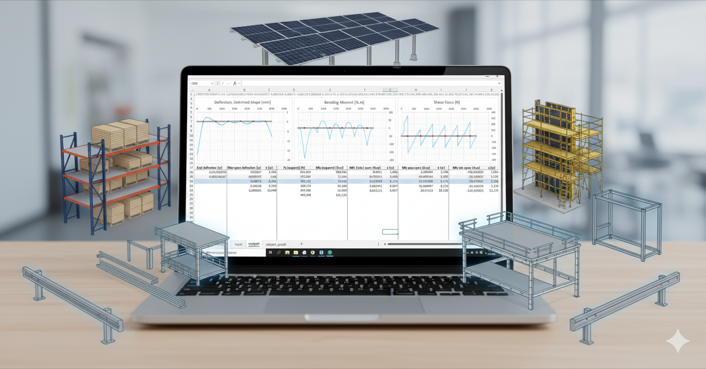

# Beam-Bending - Outil Excel rapide pour la flexion, la flèche et la vérification de charges

[🇬🇧 Read in English](README.md) 

Calculateur de poutres basé sur Excel – appuis illimités, travées multi-matériaux, diagrammes instantanés de efforts tranchants, moments fléchissants et flèches.  
Contact : beam.bending@gmail.com – Paul Brault

---

## Vue d’ensemble

Beam-Bending est un outil léger sous Excel/VBA pour l’analyse rapide de poutres.  
Il fonctionne entièrement dans Excel – aucune dépendance externe, pas d’interface supplémentaire, pas de double saisie.  
Supporte un nombre illimité de travées et de matériaux, avec des diagrammes interactifs pour efforts tranchants (V), moments fléchissants (M) et flèches.

---

## Captures d’écran

### Feuille de saisie
La géométrie de la poutre, les matériaux et les charges sont saisis directement dans des cellules Excel.

### Feuille de résultats
Les diagrammes d’efforts tranchants, de moments et de flèches sont générés instantanément.

---

## Fonctionnalités

- Nombre illimité d’appuis et de travées  
- Matériaux variables par travée (E et I différents)  
- Charges ponctuelles et réparties  
- Diagrammes V/M/flèche instantanés  
- Logique Excel 100 % visible (pas de macros ni feuilles cachées)  
- Compatible avec Excel 365 (ou versions plus anciennes avec ajustements mineurs sur les formules, VBA déjà compatible)

---

## Installation et utilisation

1. Télécharger `Beam-Bending.xlsm`  
2. Activer les macros à l’ouverture  
3. Entrer les appuis, travées, propriétés des matériaux (E, I) et charges  
4. Observer les diagrammes mis à jour automatiquement (efforts tranchants, moments, flèches)  

---

## Format des données d’entrée

Le solveur attend **1 ligne de saisie** contenant **9 champs**, séparés par `;`.  
À l’intérieur de chaque champ, les valeurs sont séparées par `:`.  
Les unités doivent être cohérentes (SI).

### Définition des champs

1. **Positions des appuis (x) [m]**  
   - Inclure `0` en première valeur si pas de porte-à-faux.  
   - Exemple : `0:3:7`

2. **Positions de fin de travée (x) [m]**  
   - Longueur totale si matériau/section uniques.  
   - Exemple : `10`

3. **Module de Young par travée [N/m²]**  
   - Exemple : `2.1E11`

4. **Moment d’inertie par travée [m⁴]**  
   - Exemple : `8.5E-6`

5. **Positions des charges ponctuelles (x) [m]**  
   - Exemple : `4:8`

6. **Valeurs des charges ponctuelles [N]**  
   - Exemple : `-5000:-3000`

7. **Positions de début des charges réparties (x) [m]**  
   - Exemple : `2`

8. **Positions de fin des charges réparties (x) [m]**  
   - Exemple : `5`

9. **Intensités des charges réparties [N/m]**  
   - Exemple : `-2000`

### Règles

- Utiliser `:` à l’intérieur des champs, `;` entre champs.  
- Les positions de travée doivent être strictement croissantes.  
- Les nombres de valeurs doivent correspondre entre champs liés (ex. positions ↔ intensités).  
- Minimum **2 appuis** requis.  
- Minimum **1 charge non nulle** requis.  

---

## Exemple avec RDM6 / RDM7

Le fichier principal (`beam-bending.xlsm`) contient un exemple préchargé reproduisant un cas traité avec **RDM6/RDM7**.

Il illustre :  
- Une poutre continue avec **6 appuis** et **7 travées**  
- **Trois matériaux différents** (E et I variables selon les travées)  
- Une combinaison de **charges ponctuelles** et **réparties**  
- Calcul instantané des réactions, moments fléchissants et flèches  
- Résultats parfaitement cohérents avec RDM6/RDM7  

### Visualisation

Modèle de référence : `example_rdm6-rdm7.fle`

---

## Applications

Ce calculateur de poutres Excel est conçu pour les projets où **vitesse, volume et efficacité** sont essentiels.  
Contrairement à des logiciels lourds ou scripts Python, le **moteur VBA optimisé pour Windows** permet des centaines de simulations en quelques fractions de seconde – sans double saisie, tout étant intégré dans Excel.  
Il gère les **cas de flexion**, **multiples poutres** et **cas de charges variés** en un seul calcul.

### Rayonnages et systèmes de stockage
Conception en série de **rayonnages palettes, étagères industrielles, racks dynamiques, systèmes AS/RS, mezzanines**.  
Vérification de la **flèche, contrainte de flexion et capacité de charge** selon **EN 15512, RMI, AISC**.

### Structures de montage photovoltaïque
Simulation rapide de **structures PV sur toiture ou au sol**.  
Prise en compte des **charges de vent/neige** et vérification des profils aluminium selon **Eurocode 1, Eurocode 9, ASCE 7**.

### Supports mécaniques et systèmes de rails/struts
Vérification rapide de **supports CVC, racks de tuyauterie, cadres modulaires**.  
Automatisation des **contrôles de portée, résistance et flèche** selon **Eurocode 3, AISI, ASTM**.

### Échafaudages et coffrages
Contrôles batch de **longrines, contreventements, poutres temporaires**.  
Sécurité assurée selon **EN 12811, OSHA, BS 5975**.

### Mezzanines et plateformes industrielles
Dimensionnement efficace de **plateformes autoportantes et planchers industriels**.  
Vérification des poutres et colonnes selon **AISC 360, IBC**.

### Profils aluminium modulaires et bâtis machines
Vérification de **structures en profilés aluminium, convoyeurs, bâtis de machines**.  
Analyse de la flèche/flexion sous **Eurocode 9, DIN 4113**.

### Garde-corps et dispositifs de retenue
Analyse rapide de **glissières, barrières de sécurité, parapets**.  
Vérification flèche/résistance aux chocs selon **EN 1317, AASHTO LRFD**.

### Points clés
- **Simulations en série** ultra-rapides  
- **Moteur VBA optimisé** pour workflows Excel natifs  
- **Pas de double saisie**  
- **Cas multiples** gérés en une fois  
- **Analyse avancée** dans un outil léger et transparent  

---

## Méthode de résolution

Le solveur est basé sur la **méthode des éléments finis Euler–Bernoulli** en statique linéaire.

1. **Discrétisation** : la poutre est divisée en éléments finis reliant des nœuds.  
2. **Raideur locale** : formulation 4×4 par élément (E, I, L).  
3. **Chargements** : conversion des charges réparties en charges nodales équivalentes.  
4. **Conditions aux limites** : contraintes d’appuis.  
5. **Résolution** : système linéaire global résolu par élimination de Gauss.  
6. **Post-traitement** : diagrammes V/M/flèches reconstitués avec fonctions de forme hermitiennes cubiques.  

---

## Avertissement

Cet outil est destiné à l’enseignement et à l’analyse rapide.  
Il n’est pas certifié pour un usage réglementaire.  
Vérifiez toujours les résultats selon les normes et le jugement professionnel.

---

## Licence

Licence MIT – usage personnel et commercial autorisé.  
Attribution appréciée.
