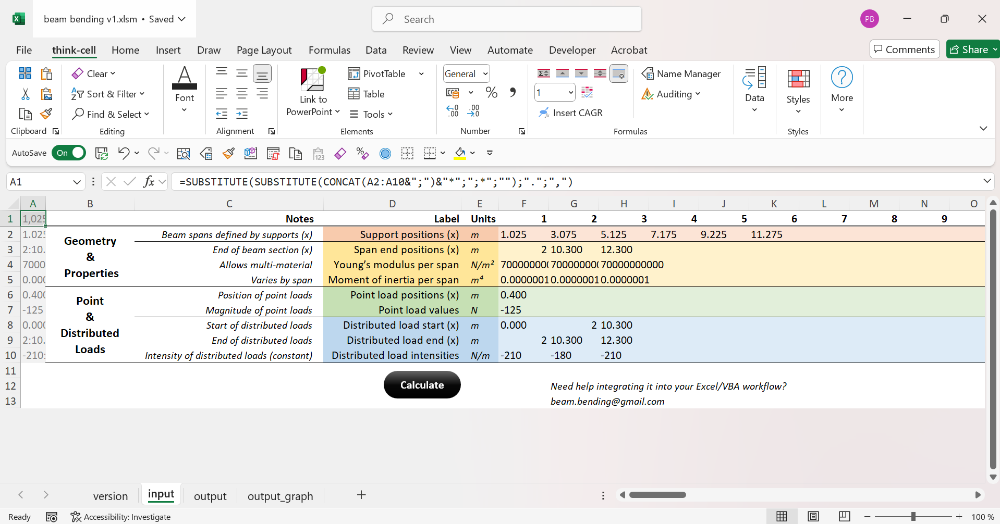
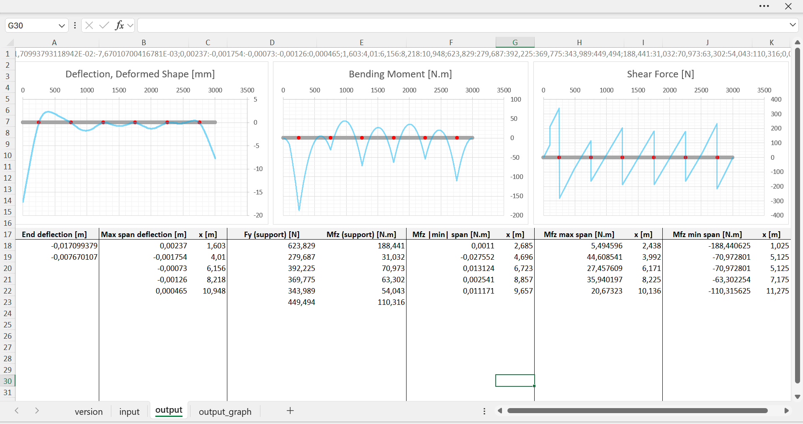
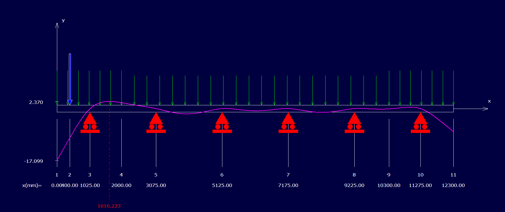

# Beam-Bending

Open Excel-based beam calculator — unlimited supports, multi-material spans, instant shear/moment/deflection charts.  
Contact: beam.bending@gmail.com — Paul Brault

---

## Overview

Beam-Bending is a lightweight Excel/VBA tool for quick beam analysis.  
It runs entirely inside Excel — no external dependencies, no UI layers, and no double data entry.  
Supports unlimited spans and materials, with live charts for shear (V), moment (M), and deflection.

---

## Screenshots

### Input sheet
Beam geometry, materials, and loads are entered directly in Excel cells.

### Output sheet
Instant shear, bending moment, and deflection diagrams are generated automatically.

---

## Features

- Unlimited supports and spans  
- Mixed materials per span (variable E and I)  
- Point and distributed loads  
- Instant V/M/deflection charts  
- 100% visible Excel logic (no hidden macros or hidden sheets)  
- Compatible with Excel 365 (or older versions with minor adjustments on formulas, VBA is already compatible)

---

## Installation & Usage

1. Download `Beam-Bending.xlsm`  
2. Enable macros when prompted  
3. Enter supports, spans, material properties (E, I), and loads  
4. View automatic chart updates for shear, moment, and deflection  

---

## Example with RDM6 / RDM7

The main workbook (`beam-bending.xlsm`) already includes a preloaded example reproducing the same case analyzed in **RDM6/RDM7**.

This benchmark illustrates:
- A continuous beam with **6 supports** and **7 spans**  
- **Three different materials** (varying E and I across spans)  
- A combination of **point** and **uniformly distributed loads**  
- Instant computation of reactions, bending moments, and deflections  
- Perfect consistency with the results from RDM6/RDM7  

This comparison validates the accuracy and speed of the Excel/VBA solver.

### Visualization

Reference model: `example_rdm6-rdm7.fle`

## Disclaimer

This tool is intended for educational and quick-analysis purposes.  
It is not certified for structural design or regulatory compliance.  
Always verify results against engineering standards and professional judgment.

---

## License

MIT License — free for personal and commercial use.  
Attribution appreciated.
